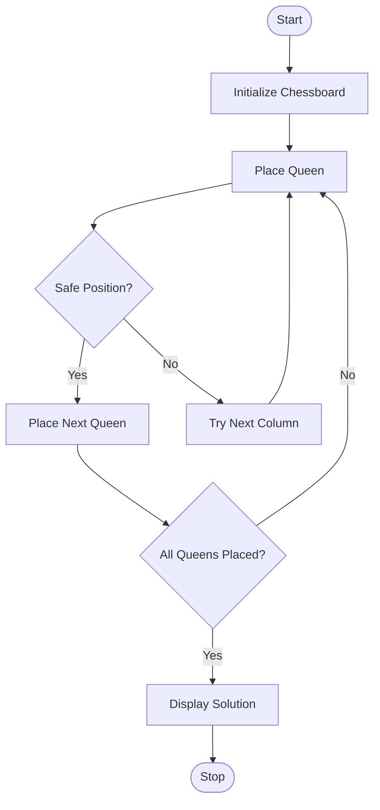

## Experiment 2: 8-Queen Problem Using Python

## Aim

To develop a Python program to solve the 8-Queen problem using the Backtracking algorithm.

## Objective

To understand the 8-Queen problem.
To implement the Backtracking algorithm in Python.
To place eight queens on an 8×8 chessboard such that no two queens attack each other.
To find a valid arrangement of all eight queens.

## Algorithm
Initialize an empty 8×8 chessboard.
Start placing queens row by row.
Check whether the current position is safe.
If the position is safe, place the queen.
Recursively place queens in the next row.
If no safe position is found, backtrack and remove the previously placed queen.
Repeat until all eight queens are placed.
Display the final chessboard arrangement.

## Flowchart 


## Python Program 

```python
def print_board(board):
    for row in board:
        print(" ".join("Q" if cell else "." for cell in row))

def is_safe(board, row, col):
    # Check column
    for i in range(row):
        if board[i][col]:
            return False

    # Check left diagonal
    i, j = row - 1, col - 1
    while i >= 0 and j >= 0:
        if board[i][j]:
            return False
        i -= 1
        j -= 1

    # Check right diagonal
    i, j = row - 1, col + 1
    while i >= 0 and j < 8:
        if board[i][j]:
            return False
        i -= 1
        j += 1

    return True

def solve(board, row):
    if row == 8:
        return True

    for col in range(8):
        if is_safe(board, row, col):
            board[row][col] = 1

            if solve(board, row + 1):
                return True

            board[row][col] = 0

    return False

board = [[0] * 8 for _ in range(8)]

if solve(board, 0):
    print("Solution Found:\n")
    print_board(board)
else:
    print("No Solution Exists")
```

## Output 

```text
Solution Found:

1 0 0 0 0 0 0 0
0 0 0 0 1 0 0 0
0 0 0 0 0 0 0 1
0 0 0 0 0 1 0 0
0 0 1 0 0 0 0 0
0 0 0 0 0 0 1 0
0 1 0 0 0 0 0 0
0 0 0 1 0 0 0 0
```

## Result

The Python program successfully solved the 8-Queen problem using the Backtracking algorithm and displayed a valid arrangement of eight queens on the chessboard such that no two queens attack each other.

## Conclusion

The 8-Queen problem was successfully implemented in Python using the Backtracking algorithm. The algorithm efficiently explored possible queen placements, backtracked when necessary, and found a valid solution. This experiment demonstrated the application of backtracking techniques in solving Artificial Intelligence search and constraint satisfaction problems.
