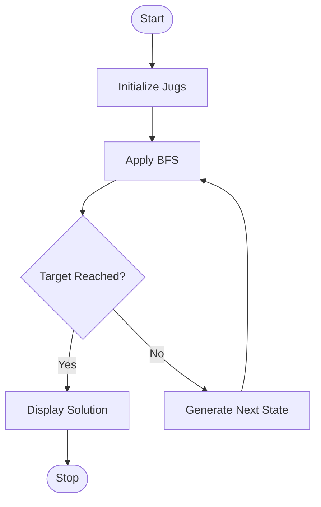

# Experiment 3: Water Jug Problem Using Python

## Aim

To develop a Python program to solve the Water Jug Problem using the Breadth-First Search (BFS) algorithm.

## Objective

- To understand the Water Jug Problem in Artificial Intelligence.
- To implement the Breadth-First Search (BFS) algorithm using Python.
- To obtain the target amount of water using two jugs of different capacities.
- To apply state-space search techniques for problem solving.

## Algorithm

1. Define the capacities of the two water jugs and the target amount.
2. Initialize the starting state as (0, 0).
3. Use Breadth-First Search (BFS) to explore all possible states.
4. Generate new states by:
   - Filling either jug.
   - Emptying either jug.
   - Pouring water from one jug to the other.
5. Keep track of visited states to avoid repetition.
6. Continue searching until the target amount is reached.
7. Display the sequence of states that leads to the solution.

## Flowchart



## Python Program

```python
from collections import deque

def water_jug_bfs(jug1, jug2, target):
    visited = set()
    queue = deque([((0, 0), [])])

    while queue:
        (a, b), path = queue.popleft()

        if (a, b) in visited:
            continue

        visited.add((a, b))
        path = path + [(a, b)]

        if a == target or b == target:
            return path

        next_states = [
            (jug1, b),
            (a, jug2),
            (0, b),
            (a, 0),
            (max(0, a - (jug2 - b)), min(jug2, a + b)),
            (min(jug1, a + b), max(0, b - (jug1 - a)))
        ]

        for state in next_states:
            if state not in visited:
                queue.append((state, path))

    return None

jug1 = 4
jug2 = 3
target = 2

solution = water_jug_bfs(jug1, jug2, target)

if solution:
    print("Solution Found:")
    for step in solution:
        print(step)
else:
    print("No Solution Exists")
```

## Output

```text
Solution Found:

(0, 0)
(0, 3)
(3, 0)
(3, 3)
(4, 2)
```

## Result

The Water Jug Problem was successfully solved using the Breadth-First Search (BFS) algorithm. The program found a valid sequence of states to obtain the target amount of water.

## Conclusion

The Water Jug Problem was successfully implemented using Python and the Breadth-First Search (BFS) algorithm. The algorithm explored all possible states systematically and reached the target amount efficiently. This experiment demonstrated the application of state-space search techniques in Artificial Intelligence.
