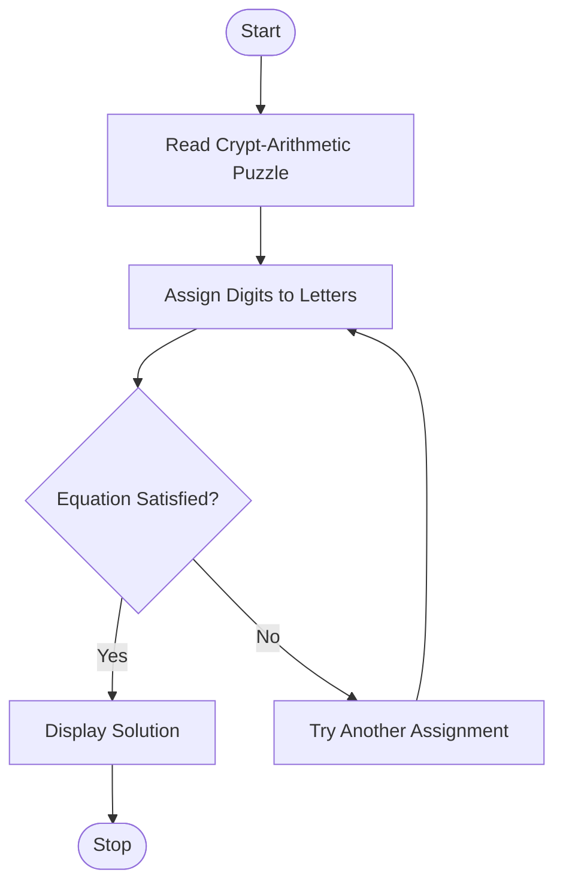

# Experiment 4: Crypt-Arithmetic Problem Using Python

## Aim

To develop a Python program to solve the Crypt-Arithmetic problem using Artificial Intelligence techniques.

## Objective

- To understand the Crypt-Arithmetic problem in Artificial Intelligence.
- To implement a Python program for solving Crypt-Arithmetic puzzles.
- To assign unique digits to letters while satisfying the given arithmetic equation.
- To apply constraint satisfaction techniques to find the correct solution.

## Algorithm

1. Define the letters involved in the Crypt-Arithmetic puzzle.
2. Assign unique digits (0–9) to each letter.
3. Ensure that no two letters have the same digit.
4. Verify that the leading letters are not assigned zero.
5. Check whether the arithmetic equation is satisfied.
6. If the equation is satisfied, display the solution.
7. Otherwise, continue searching until a valid solution is found.

## Flowchart



## Python Program

```python
from itertools import permutations

letters = ('S', 'E', 'N', 'D', 'M', 'O', 'R', 'Y')
digits = (0, 1, 2, 3, 4, 5, 6, 7, 8, 9)

for perm in permutations(digits, len(letters)):
    d = dict(zip(letters, perm))

    if d['S'] == 0 or d['M'] == 0:
        continue

    send = d['S']*1000 + d['E']*100 + d['N']*10 + d['D']
    more = d['M']*1000 + d['O']*100 + d['R']*10 + d['E']
    money = d['M']*10000 + d['O']*1000 + d['N']*100 + d['E']*10 + d['Y']

    if send + more == money:
        print("Solution Found:")
        print("SEND =", send)
        print("MORE =", more)
        print("MONEY =", money)
        break
```

## Output

```text
Solution Found:

SEND = 9567
MORE = 1085
MONEY = 10652
```

## Result

The Crypt-Arithmetic problem was successfully solved using Python by assigning unique digits to each letter while satisfying the arithmetic equation.

## Conclusion

The Crypt-Arithmetic problem was successfully implemented using Python. The program assigned unique digits to letters and verified the arithmetic constraint to obtain the correct solution. This experiment demonstrated the application of constraint satisfaction techniques in Artificial Intelligence.
