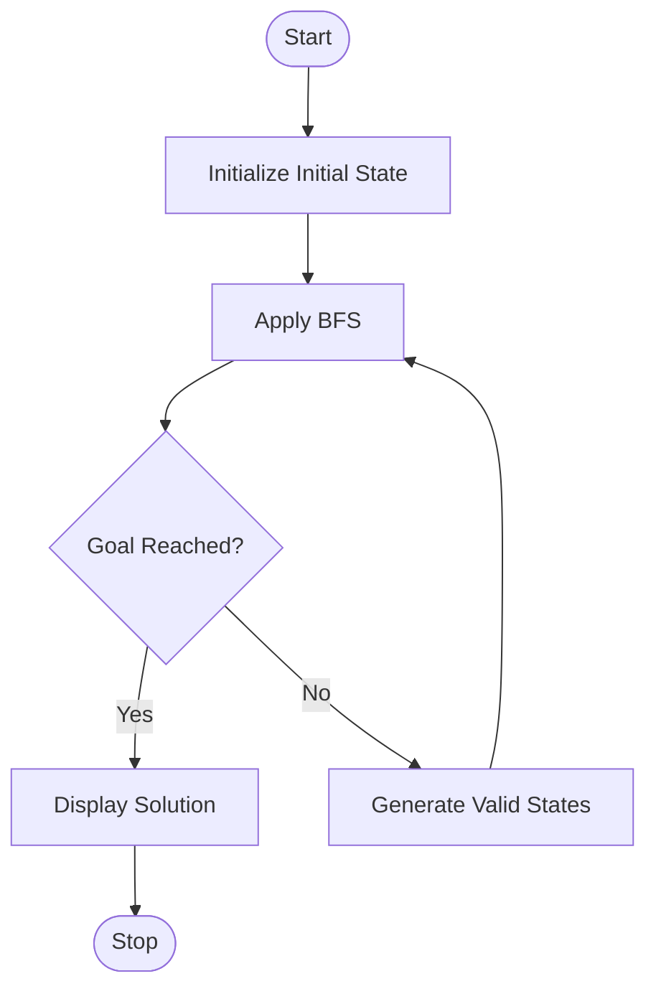

# Experiment 5: Missionaries and Cannibals Problem Using Python

## Aim

To develop a Python program to solve the Missionaries and Cannibals problem using the Breadth-First Search (BFS) algorithm.

## Objective

- To understand the Missionaries and Cannibals problem in Artificial Intelligence.
- To implement the Breadth-First Search (BFS) algorithm using Python.
- To transport all missionaries and cannibals safely across the river.
- To apply state-space search techniques to find the optimal solution.

## Algorithm

1. Define the initial state and the goal state.
2. Initialize the queue with the initial state.
3. Generate all possible valid moves for the boat.
4. Check whether each generated state is safe.
5. Ignore invalid or previously visited states.
6. Continue exploring states using BFS.
7. If the goal state is reached, display the solution path.
8. Otherwise, continue until all possible states are explored.

## Flowchart



## Python Program

```python
from collections import deque

def is_valid(m_left, c_left):
    m_right = 3 - m_left
    c_right = 3 - c_left

    if (m_left > 0 and m_left < c_left):
        return False
    if (m_right > 0 and m_right < c_right):
        return False
    return 0 <= m_left <= 3 and 0 <= c_left <= 3

def bfs():
    start = (3, 3, 1)
    goal = (0, 0, 0)

    moves = [(1,0),(2,0),(0,1),(0,2),(1,1)]

    queue = deque([(start, [])])
    visited = set()

    while queue:
        state, path = queue.popleft()

        if state in visited:
            continue

        visited.add(state)
        path = path + [state]

        if state == goal:
            return path

        m_left, c_left, boat = state

        for m, c in moves:
            if boat == 1:
                new_state = (m_left-m, c_left-c, 0)
            else:
                new_state = (m_left+m, c_left+c, 1)

            if is_valid(new_state[0], new_state[1]):
                queue.append((new_state, path))

    return None

solution = bfs()

print("Solution Path:")
for step in solution:
    print(step)
```

## Output

```text
Solution Path:

(3, 3, 1)
(3, 1, 0)
(3, 2, 1)
(3, 0, 0)
(3, 1, 1)
(1, 1, 0)
(2, 2, 1)
(0, 2, 0)
(0, 3, 1)
(0, 1, 0)
(1, 1, 1)
(0, 0, 0)
```

## Result

The Missionaries and Cannibals problem was successfully solved using the Breadth-First Search (BFS) algorithm. The program found a valid sequence of moves to transport all missionaries and cannibals safely across the river.

## Conclusion

The Missionaries and Cannibals problem was successfully implemented using Python and the Breadth-First Search (BFS) algorithm. The algorithm explored valid states systematically and reached the goal state without violating the problem constraints. This experiment demonstrated the application of state-space search techniques in Artificial Intelligence.
