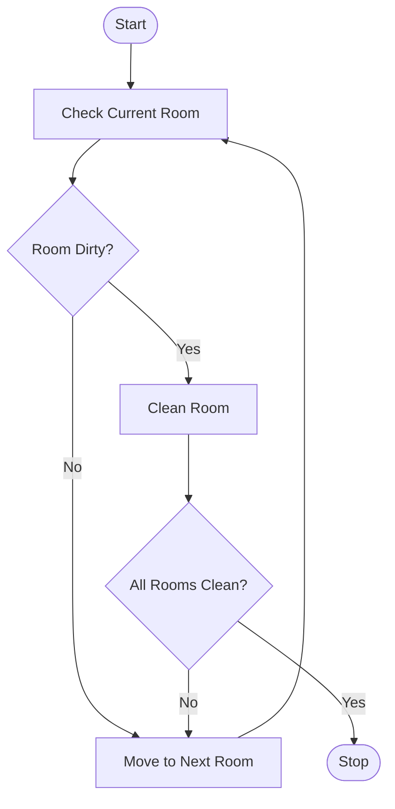

# Experiment 6: Vacuum Cleaner Problem Using Python

## Aim

To develop a Python program to simulate the Vacuum Cleaner Problem using a simple reflex agent.

## Objective

- To understand the Vacuum Cleaner Problem in Artificial Intelligence.
- To implement a simple reflex agent using Python.
- To clean all dirty rooms by performing appropriate actions.
- To demonstrate intelligent agent behavior in a simple environment.

## Algorithm

1. Define the environment with two rooms (A and B).
2. Check the current location of the vacuum cleaner.
3. If the current room is dirty, clean it.
4. If the current room is clean, move to the other room.
5. Repeat the process until both rooms are clean.
6. Display each action performed by the vacuum cleaner.
7. Stop when the environment becomes completely clean.

## Flowchart



## Python Program

```python
# Vacuum Cleaner Problem

rooms = {'A': 'Dirty', 'B': 'Dirty'}

location = 'A'

while True:
    print("Current Location:", location)
    print("Room Status:", rooms)

    if rooms[location] == 'Dirty':
        print("Action: Clean", location)
        rooms[location] = 'Clean'
    else:
        if location == 'A':
            print("Action: Move Right")
            location = 'B'
        else:
            print("Action: Move Left")
            location = 'A'

    if rooms['A'] == 'Clean' and rooms['B'] == 'Clean':
        print("\nAll rooms are clean.")
        break
```

## Output

```text
Current Location: A
Room Status: {'A': 'Dirty', 'B': 'Dirty'}
Action: Clean A

Current Location: A
Room Status: {'A': 'Clean', 'B': 'Dirty'}
Action: Move Right

Current Location: B
Room Status: {'A': 'Clean', 'B': 'Dirty'}
Action: Clean B

All rooms are clean.
```

## Result

The Vacuum Cleaner Problem was successfully simulated using a simple reflex agent. The agent cleaned all the dirty rooms by sensing the environment and performing the appropriate actions.

## Conclusion

The Vacuum Cleaner Problem was successfully implemented in Python using a simple reflex agent. The agent perceived the environment, cleaned the dirty rooms, and terminated after achieving the goal. This experiment demonstrated the basic concept of intelligent agents and their behavior in Artificial Intelligence.
