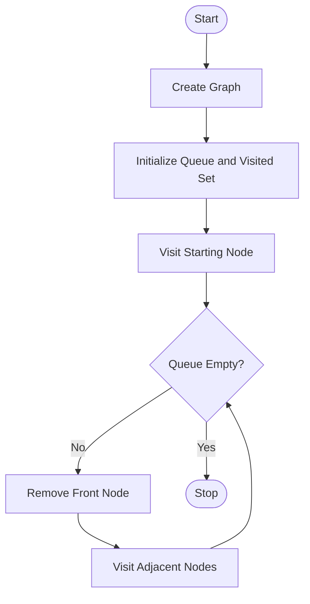

# Experiment 7: Breadth-First Search (BFS) Using Python

## Aim

To implement the Breadth-First Search (BFS) algorithm using Python for graph traversal.

## Objective

- To understand the Breadth-First Search (BFS) algorithm.
- To implement BFS using Python.
- To traverse all vertices of a graph in level-by-level order.
- To demonstrate graph traversal using a queue.

## Algorithm

1. Create a graph using an adjacency list.
2. Select the starting vertex.
3. Initialize an empty queue and a visited set.
4. Add the starting vertex to the queue and mark it as visited.
5. Remove a vertex from the front of the queue.
6. Visit and display the vertex.
7. Add all unvisited neighboring vertices to the queue.
8. Repeat until the queue becomes empty.

## Flowchart



## Python Program

```python
from collections import deque

graph = {
    'A': ['B', 'C'],
    'B': ['D', 'E'],
    'C': ['F'],
    'D': [],
    'E': ['F'],
    'F': []
}

visited = set()
queue = deque()

start = 'A'
visited.add(start)
queue.append(start)

print("BFS Traversal:")

while queue:
    vertex = queue.popleft()
    print(vertex, end=" ")

    for neighbor in graph[vertex]:
        if neighbor not in visited:
            visited.add(neighbor)
            queue.append(neighbor)
```

## Output

```text
BFS Traversal

Starting Node : A

Traversal Order:
A → B → C → D → E → F

Traversal Completed Successfully.
```

## Result

The Breadth-First Search (BFS) algorithm was successfully implemented in Python. The graph was traversed level by level starting from the selected source node.

## Conclusion

The BFS algorithm was successfully implemented using Python. It traversed the graph in breadth-first order using a queue and visited every reachable vertex exactly once. This experiment demonstrated the application of BFS in graph traversal and Artificial Intelligence search problems.
