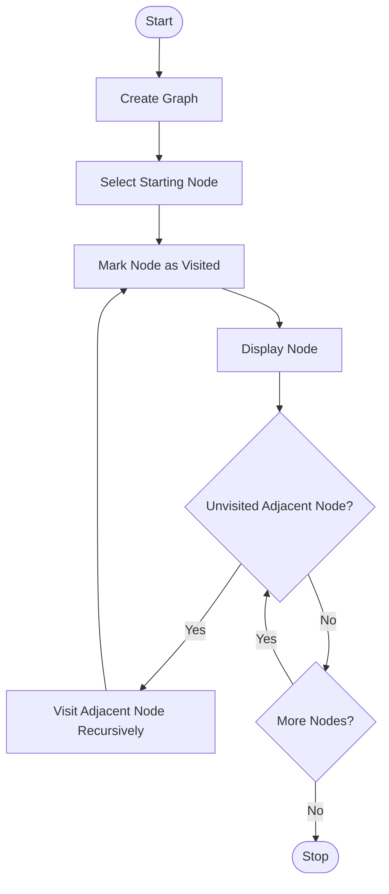

# Experiment 8: Depth-First Search (DFS) Using Python

## Aim

To implement the Depth-First Search (DFS) algorithm using Python for graph traversal.

## Objective

- To understand the Depth-First Search (DFS) algorithm.
- To implement DFS using Python.
- To traverse all vertices of a graph using depth-first traversal.
- To demonstrate graph traversal using recursion.

## Algorithm

1. Create a graph using an adjacency list.
2. Select the starting vertex.
3. Mark the starting vertex as visited.
4. Visit and display the current vertex.
5. Recursively visit each unvisited adjacent vertex.
6. Continue until all reachable vertices are visited.
7. Stop when the traversal is complete.

## Flowchart



## Python Program

```python
graph = {
    'A': ['B', 'C'],
    'B': ['D', 'E'],
    'C': ['F'],
    'D': [],
    'E': ['F'],
    'F': []
}

visited = set()

def dfs(node):
    if node not in visited:
        print(node, end=" ")
        visited.add(node)

        for neighbor in graph[node]:
            dfs(neighbor)

print("DFS Traversal:")
dfs('A')
```

## Output

```text
DFS Traversal

Starting Node : A

Traversal Order:
A → B → D → E → F → C

Traversal Completed Successfully.
```

## Result

The Depth-First Search (DFS) algorithm was successfully implemented in Python. The graph was traversed by exploring each branch completely before backtracking.

## Conclusion

The DFS algorithm was successfully implemented using Python. It traversed the graph in depth-first order using recursion and visited every reachable vertex exactly once. This experiment demonstrated the application of DFS in graph traversal and Artificial Intelligence search problems.
