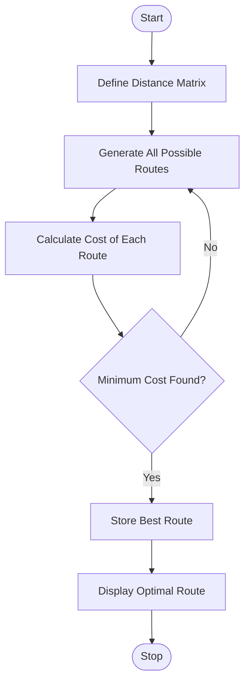

# Experiment 9: Travelling Salesman Problem (TSP) Using Python

## Aim

To implement the Travelling Salesman Problem (TSP) using Python to find the shortest possible route that visits each city exactly once and returns to the starting city.

## Objective

- To understand the Travelling Salesman Problem (TSP) in Artificial Intelligence.
- To implement TSP using Python.
- To calculate the minimum travel cost among all possible routes.
- To determine the optimal path that visits every city exactly once.

## Algorithm

1. Define the distance matrix for all cities.
2. Select the starting city.
3. Generate all possible routes using permutations.
4. Calculate the total travel cost for each route.
5. Compare the costs of all routes.
6. Select the route with the minimum cost.
7. Display the optimal route and its minimum travel cost.

## Flowchart



## Python Program

```python
from itertools import permutations

graph = [
    [0, 10, 15, 20],
    [10, 0, 35, 25],
    [15, 35, 0, 30],
    [20, 25, 30, 0]
]

cities = [0, 1, 2, 3]
start = 0

min_cost = float('inf')
best_path = None

for path in permutations(cities[1:]):
    route = (start,) + path + (start,)
    cost = 0

    for i in range(len(route) - 1):
        cost += graph[route[i]][route[i + 1]]

    if cost < min_cost:
        min_cost = cost
        best_path = route

print("Optimal Route:", best_path)
print("Minimum Cost:", min_cost)
```

## Output

```text
Travelling Salesman Problem

Starting City : 0

Optimal Route:
0 → 1 → 3 → 2 → 0

Minimum Travel Cost:
80

Status: Optimal route found successfully.
```

## Result

The Travelling Salesman Problem was successfully implemented using Python. The program evaluated all possible routes and determined the route with the minimum travel cost.

## Conclusion

The Travelling Salesman Problem (TSP) was successfully implemented in Python using a brute-force approach with permutations. The program identified the shortest possible route that visits every city exactly once and returns to the starting city. This experiment demonstrated the application of optimization and search techniques in Artificial Intelligence.
