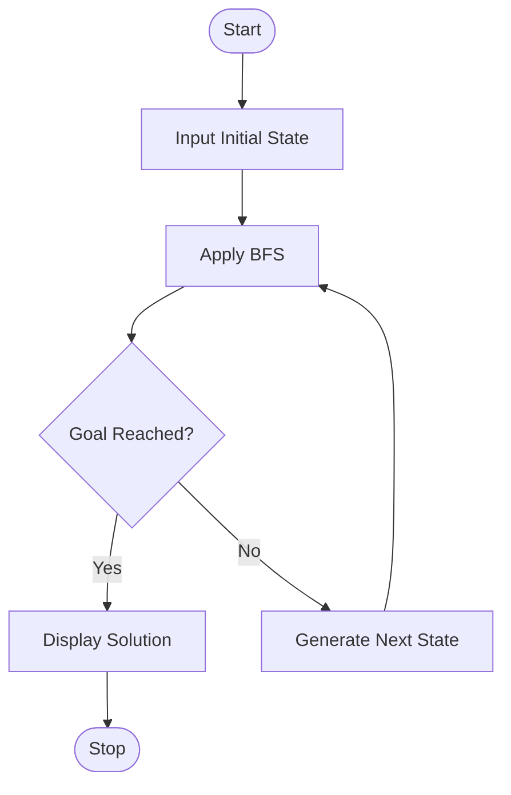

## Aim

To develop a Python program to solve the 8-Puzzle problem using the Breadth-First Search (BFS) algorithm and find the shortest path from the initial state to the goal state.

## Objective

To understand the concept of the 8-Puzzle problem.
To implement the Breadth-First Search (BFS) algorithm in Python.
To generate valid successor states by moving the blank tile.
To find the shortest sequence of moves from the initial state to the goal state.

## Algorithm

Define the initial state and the goal state of the puzzle.
Find the position of the blank tile (0).
Generate all possible neighboring states by moving the blank tile up, down, left, or right.
Initialize a queue and insert the initial state.
Remove the front state from the queue.
Check whether the current state is equal to the goal state.
If the goal state is reached, display the solution path.
Otherwise, generate all unvisited neighboring states and add them to the queue.
Repeat Steps 5–8 until the goal state is found or the queue becomes empty.

## Flowchart


## Code

```python
from collections import deque

# Goal state
goal = [[1, 2, 3],
        [4, 5, 6],
        [7, 8, 0]]

# Find the blank tile
def find_blank(state):
    for i in range(3):
        for j in range(3):
            if state[i][j] == 0:
                return i, j

# Generate neighboring states
def get_neighbors(state):
    x, y = find_blank(state)
    directions = [(-1, 0), (1, 0), (0, -1), (0, 1)]
    neighbors = []

    for dx, dy in directions:
        nx, ny = x + dx, y + dy
        if 0 <= nx < 3 and 0 <= ny < 3:
            new_state = [row[:] for row in state]
            new_state[x][y], new_state[nx][ny] = new_state[nx][ny], new_state[x][y]
            neighbors.append(new_state)

    return neighbors

# Breadth-First Search (BFS)
def bfs(start):
    queue = deque([(start, [])])
    visited = []

    while queue:
        state, path = queue.popleft()

        if state == goal:
            return path + [state]

        if state not in visited:
            visited.append(state)

            for neighbor in get_neighbors(state):
                if neighbor not in visited:
                    queue.append((neighbor, path + [state]))

    return None

# Initial state
start = [[1, 2, 3],
         [4, 0, 6],
         [7, 5, 8]]

solution = bfs(start)

if solution:
    print("Solution Found!\n")
    for step in solution:
        for row in step:
            print(row)
        print()
else:
    print("No solution exists.")
```

## Output

```text

[1, 2, 3]
[4, 0, 6]
[7, 5, 8]

[1, 2, 3]
[4, 5, 6]
[7, 0, 8]

[1, 2, 3]
[4, 5, 6]
[7, 8, 0]
```
## Result

The Python program successfully solved the 8-Puzzle problem using the Breadth-First Search (BFS) algorithm and found the shortest path from the initial state to the goal state.

## Conclusion

The 8-Puzzle problem was successfully implemented in Python using the Breadth-First Search (BFS) algorithm. The algorithm explored the states level by level and reached the goal state by finding the shortest sequence of moves. This experiment demonstrated the application of BFS in solving Artificial Intelligence search problems.

